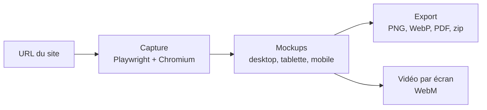

# Viewly

> Colle l'URL d'un site, récupère des mockups propres en desktop, tablette et mobile. Viewly supprime le temps perdu à composer des mockups à la main en fin de projet.
>
> **Statut** : web app locale, pas encore de démo en ligne. Suivi du projet : [CHANGELOG](CHANGELOG.md).

## Sommaire

- [Ce que fait Viewly](#ce-que-fait-viewly)
- [Lancer en local](#lancer-en-local)
- [Commandes](#commandes)
- [Stack](#stack)
- [Structure du projet](#structure-du-projet)
- [Limites connues](#limites-connues)
- [Roadmap](#roadmap)
- [Documentation](#documentation)

<br><br>

## Ce que fait Viewly.



- **Deux modes de capture** : vue complète (une page entière) ou par écrans (un screenshot par hauteur de fenêtre, au format fixe).

- **Trois devices**, avec presets (desktop, iPad, iPhone, Android) et résolution personnalisée.

- **Deux niveaux de qualité** : standard (1x) ou haute (2x, rendu Retina).

- **Vidéo par écran** (mode par écrans) : durée et échelle réglables, simulation de survol, option pour filmer le scroll vers l'écran suivant.

- **Export** en PNG, WebP ou PDF, un fichier par écran, en téléchargement individuel ou en zip.

- **Sites protégés** : authentification HTTP basique optionnelle (staging).

- **Captures nettes** : fermeture des bannières cookies et masquage des widgets de chat en best-effort, attente de la stabilisation visuelle, prise en charge des sites au scroll piloté en JavaScript.

<br><br>

## Lancer en local.

Prérequis : Node.js 24 (version utilisée par la CI).

```bash
npm install
npx playwright install chromium
npm run dev
```

Ouvrir [http://localhost:3000](http://localhost:3000), coller une URL, télécharger les mockups générés.

> Si la génération échoue après une mise à jour, vérifier que Chromium est bien installé (`npx playwright install chromium`) et qu'un seul serveur de dev tourne sur le port 3000.

<br><br>

## Commandes.

| Commande | Rôle |
|---|---|
| `npm run dev` | Serveur de développement |
| `npm run build` | Build de production |
| `npm run start` | Serveur de production (après build) |
| `npm run lint` | Lint (ESLint) |
| `npm test` | Tests unitaires (Vitest) |

La CI GitHub Actions lance lint, build et tests à chaque push et pull request sur `main`.

<br><br>

## Stack.

Next.js (App Router, TypeScript, Tailwind) · Playwright (rendu headless) · ffmpeg-static (vidéo) · sharp (conversion d'images) · pdf-lib (PDF) · jszip (zip) · Vitest (tests).

<br><br>

## Structure du projet.

| Dossier | Contenu |
|---|---|
| `app/` | Interface et routes API (`app/api/mockup/`) |
| `lib/capture/` | Capture des pages, gestion du navigateur, bannières cookies, vidéo |
| `lib/export/` | Conversion d'images, PDF, zip |
| `lib/` (racine) | Store de jobs en mémoire (`jobs.ts`), nommage des fichiers (`siteSlug.ts`) |
| `docs/` | Recherche UX et structure du contenu UX writing |

<br><br>

## Limites connues.

- Certains sites bloquent les navigateurs automatisés (anti-bot) : Viewly affiche alors un message d'erreur explicite.

- Les bannières cookies sont trop variées pour une couverture à 100 %.

- Sur les pages très longues ou très animées, la génération par écrans peut prendre plusieurs minutes.

- Les jobs vivent en mémoire et expirent : il n'y a pas d'historique.

<br><br>

## Roadmap.

- **Backlog produit (UX research)** : import de médias divers (haute priorité), import direct depuis Figma (haute priorité), extension VS Code ou import de code pour développeurs (priorité moyenne).

- **Plus tard** : détection de zones sémantiques de la page (hero, features, footer), puis variantes de layout générées automatiquement.

<br><br>

## Documentation.

- [Recherche UX](docs/ux-research.md) : persona, problem statement, How Might We, backlog.

- [Structure du contenu UX writing](docs/ux-writing/structure.md) : slots de texte à écrire par page, sans texte final.

- [Changelog](CHANGELOG.md) : décisions et évolutions du projet.
