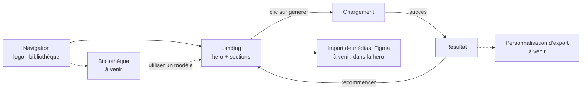
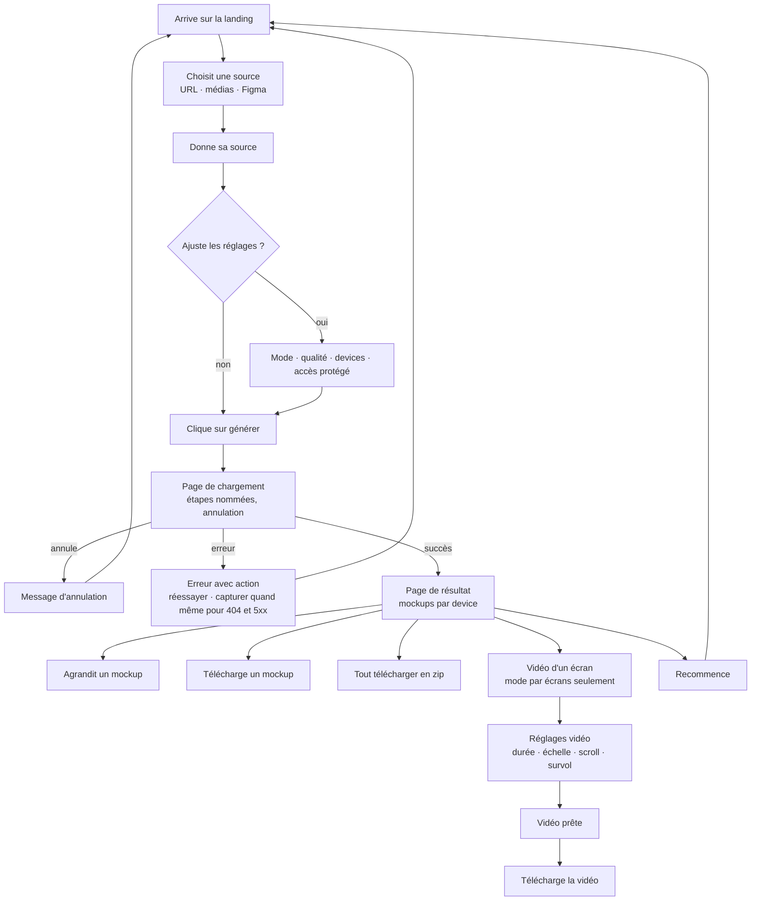

# Viewly : plan du site, parcours et fonctionnalités

> **Statut** : document de structure, 4 octobre 2026. Il dit **quoi dessiner** (pages, parcours, fonctionnalités, composants), pas comment ça se présente. Aucun texte d'interface, aucun choix visuel.
>
> **Sources** : code actuel (`app/page.tsx`, API), `docs/ux-writing/*`, backlog UX research, règles du produit dans `CLAUDE.md`.

## Sommaire

- [Plan du site](#plan-du-site)
- [Parcours principal](#parcours-principal)
- [Fonctionnalités](#fonctionnalités)
- [Contenu de chaque page](#contenu-de-chaque-page)
- [Composants à prévoir](#composants-à-prévoir)
- [Ce qu'il reste à décider](#ce-quil-reste-à-décider)

  

## Plan du site.

Trait plein : existe ou décidé. Trait pointillé : à venir.

> Règles du produit qui bornent ce plan : pas de compte, pas de connexion, pas de tarifs. Les résultats sont gardés dans le navigateur.

  

## Parcours principal.

  

## Fonctionnalités.

| Fonctionnalité | État | Où |
|---|---|---|
| Source : URL d'un site | Existe | Landing (hero) |
| Source : site protégé par identifiant et mot de passe | Existe | Landing (hero) |
| Source : fichiers et médias divers | À venir (priorité haute) | Landing (hero) |
| Source : import direct depuis Figma | À venir (priorité haute) | Landing (hero) |
| Source : extension VS Code ou import de code | À venir (priorité moyenne) | À définir |
| Mode de capture : vue complète ou par écrans | Existe | Landing (hero) |
| Qualité : standard ou haute | Existe | Landing (hero) |
| Devices : desktop, tablette, mobile (au moins un) | Existe | Landing (hero) |
| Résolutions : presets et valeur personnalisée | Existe | Landing (hero) |
| Génération avec progression et annulation | Existe, progression à améliorer (indicateur global, étapes nommées) | Chargement |
| Mockups groupés par device, aperçu agrandi | Existe | Résultat |
| Export PNG, WebP ou PDF, un fichier par écran | Existe | Résultat |
| Téléchargement groupé en zip | Existe | Résultat |
| Vidéo d'un écran (durée, échelle, scroll, survol) | Existe, en test, mode par écrans seulement | Résultat |
| Bouton "capturer quand même" pour les pages 404 et 5xx | Décidé, à développer | Chargement (erreur) |
| Résultats gardés dans le navigateur | Décidé, à développer | Résultat |
| Mention de conservation des résultats | Décidé | Résultat |
| Bibliothèque de modèles libres (scènes, devices, layouts) | À venir (non priorisée) | Page à part |
| Sorties sans appareil (grille bento, plusieurs écrans) | Idée | Bibliothèque ou résultat |
| Personnalisation d'export | À venir | À définir |
| Comptes, connexion, tarifs | Exclus | Aucune |

  

## Contenu de chaque page.

### Landing

- **Navigation** : logo, lien vers la bibliothèque. Rien d'autre n'est décidé.

- **Hero** : titre, sous-titre, choix de la source, champ ou zone de dépôt, réglages accessibles directement, bouton de génération.

- **Sections** (celles de la structure UX writing, à valider au design) : le problème de la méthode manuelle, comment ça marche, les usages (portfolio, réseaux sociaux, client), le contrôle (formats, export), la vidéo, la bibliothèque, les fonctionnalités à venir, la FAQ, un appel final.

- **Pied de page.**

### Chargement

- Un indicateur de progression global avec l'étape en cours.

- Une liste des avertissements.

- Un bouton d'annulation.

- États : en cours, avec avertissements, erreur avec action, annulé.

### Résultat

- Mention de conservation des résultats.

- Mockups groupés par device, puis par écran.

- Aperçu agrandi d'un mockup.

- Menu de format d'export, télécharger un mockup, tout télécharger en zip.

- Bouton vidéo et panneau de réglages vidéo, lecteur et téléchargement de la vidéo.

- Recommencer.

- États : vidéo en cours, vidéo prête, erreur d'export, stockage du navigateur indisponible.

### Bibliothèque (à venir)

- Catégories (scènes, devices, layouts), fiche de modèle, mention de licence, bouton pour utiliser un modèle, recherche sans résultat.

### Import et personnalisation d'export (à venir)

- À définir avec les fonctionnalités.

  

## Composants à prévoir.

Cette liste alimente le design system.

| Famille | Composants |
|---|---|
| Actions | Bouton principal, bouton secondaire, lien, bouton avec menu (format d'export) |
| Saisie | Champ URL, zone de dépôt de fichiers, champs numériques (largeur, hauteur, durée), menu déroulant (résolution), choix exclusifs (mode, qualité, échelle), cases à cocher (devices, scroll), boutons de choix de source |
| Retours | Indicateur de progression global, liste d'avertissements, message d'erreur avec action, mention d'information (conservation) |
| Contenu | Carte mockup, aperçu agrandi, groupe par device, panneau vidéo, lecteur vidéo |
| Structure | Navigation, pied de page, section de landing, carte de fonctionnalité, entrée de FAQ |
| Bibliothèque | Carte de modèle, filtre de catégorie, état vide |

États à prévoir pour chaque composant interactif : normal, survol, focus, désactivé, erreur, chargement.

  

## Ce qu'il reste à décider.

- Que contient la navigation, à part le logo et la bibliothèque ?

- Faut-il des pages légales ou de contact, sans compte ?

- Où vit la personnalisation d'export (dans le résultat, ou dans une étape à part) ?

- L'outil lui-même doit-il fonctionner sur mobile ?

- Y a-t-il un mode sombre ?

- Quel site montrer comme exemple de résultat dans la landing ?
