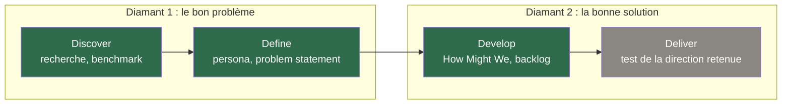
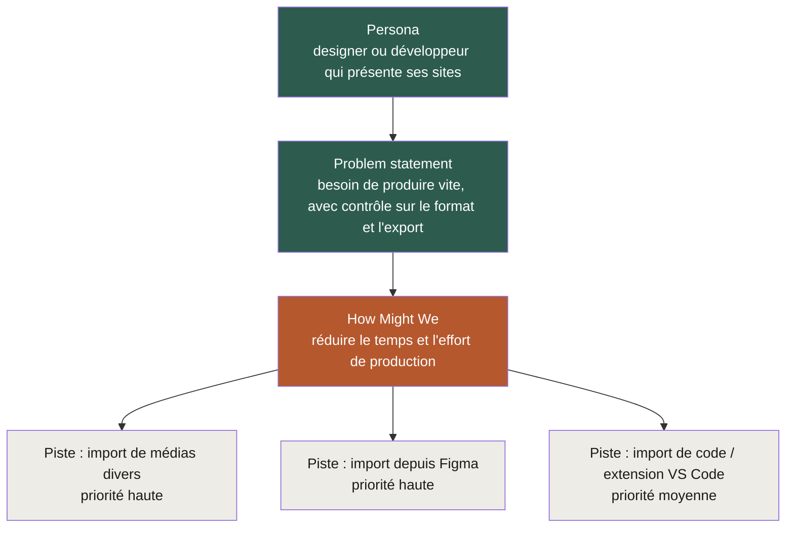

# UX Research : Discover & Define

> **Ce que c'est** : phase Discover/Define/Develop (cadre Double Diamond) appliquée au projet Viewly. Statut : Define et Develop bouclés le 3 octobre 2026.
>
> Document complet avec détail (benchmark concurrentiel, recherche secondaire, grille d'analyse) : [page Notion UX Research](https://app.notion.com/p/3ed207130ab48149bfd4e5620ed05fd4).

## Sommaire

- [Limite assumée](#limite-assumée)
- [Persona](#persona)
- [Problem statement](#problem-statement)
- [How Might We](#how-might-we)
- [Backlog de pistes (Develop)](#backlog-de-pistes-develop)
- [Comment chaque pièce découle de la précédente](#comment-chaque-pièce-découle-de-la-précédente)
- [Prochaine étape](#prochaine-étape)

  

Recherche UX menée sur le projet Viewly, dans le cadre du module UX Design (My Digital School) et du développement du produit. Suit le cadre Double Diamond (Discover, Define, Develop, Deliver, Design Council UK).

**Statut** : Discover, Define et Develop bouclés le 3 octobre 2026. Deliver pas encore commencé (teste la piste retenue une fois priorisée côté implémentation).

  

## Limite assumée.

> Les entretiens directs prévus n'ont pas pu être menés (accès limité au terrain). Le persona et le problem statement ci-dessous s'appuient sur l'hypothèse de départ, un benchmark concurrentiel et une recherche secondaire (témoignages publics de designers sur des forums), pas sur des entretiens directs.
>
> À confronter à du vrai terrain si l'occasion se présente plus tard.

  

## Persona.

Un designer ou développeur qui doit produire des visuels de présentation de ses sites web, pour plusieurs usages : portfolio, réseaux sociaux (Behance, LinkedIn, Instagram), présentation client.

Besoin central : produire ce rendu rapidement, avec moins d'effort que la méthode manuelle, tout en gardant un contrôle sur le format, la personnalisation et l'export.

  

## Problem statement.

Un designer ou développeur a besoin de produire rapidement un visuel de présentation soigné de son site web (pour son portfolio, les réseaux sociaux ou un client), avec un contrôle fin sur le format et l'export, car le faire à la main (captures, Photoshop, mise en forme) prend trop de temps pour une tâche qui n'a pas de valeur créative en elle-même.

> **Point de vigilance** : Viewly ne fonctionne actuellement qu'à partir d'un site déjà en ligne (via URL), pas d'une maquette Figma pas encore développée ni de fichiers de code. Risque que le vrai besoin se situe à un autre stade du projet que celui couvert par l'outil aujourd'hui.

  

## How Might We.

Comment pourrions-nous réduire le temps et l'effort qu'un designer ou développeur passe à produire un visuel de présentation, afin qu'il reste plus de temps pour le travail créatif réel plutôt que pour une tâche mécanique répétitive ?

  

## Backlog de pistes (Develop).

| Piste | Public visé | Risque / limite | Priorité |
|---|---|---|---|
| Import de médias divers (pas seulement une URL de site en ligne) | Designers et développeurs | Portée vague ("médias divers"), à préciser | Haute |
| Import direct depuis Figma (lien ou export) | Designers surtout | Dépend de l'API Figma, complexité technique à vérifier | Haute |
| Import de fichiers de code / extension VS Code | Développeurs spécifiquement | Piste plus spécifique et complexe à construire en premier | Moyenne |

> La priorité "moyenne" de la piste développeurs ne reflète pas une importance moindre de ce public (le persona inclut "designer ou développeur" depuis le départ), seulement qu'il s'agit d'une piste plus complexe à construire en premier que les deux autres.

  

## Comment chaque pièce découle de la précédente.

  

## Prochaine étape.

Mise en forme du document final pour le rendu de cours, en attente du brief exact du professeur.
