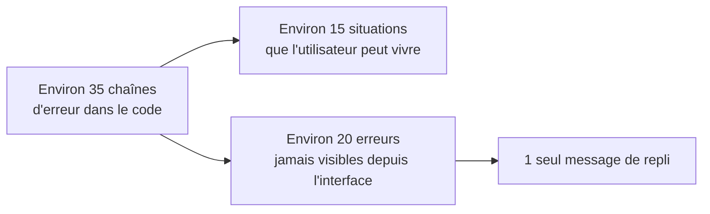

# Viewly : inventaire des erreurs

> **Statut** : inventaire des faits, 3 octobre 2026. **Aucun message rédigé.** Pour chaque situation : ce qui se passe, la vraie cause, ce que l'utilisateur peut faire. Les mots viendront après le user-test, en appliquant le ton posé (sobre sur les erreurs).
>
> **Source** : lecture du code (`app/page.tsx`, `app/api/mockup/**`, `lib/capture/**`, `lib/jobs.ts`).

## Sommaire

- [Ce que l'inventaire révèle](#ce-que-linventaire-révèle)
- [Saisie (landing)](#saisie-landing)
- [Génération (chargement)](#génération-chargement)
- [Résultat et export](#résultat-et-export)
- [Panneau vidéo](#panneau-vidéo)
- [Avertissements](#avertissements)
- [Impact du stockage dans le navigateur](#impact-du-stockage-dans-le-navigateur)
- [Erreurs que l'utilisateur ne peut pas atteindre](#erreurs-que-lutilisateur-ne-peut-pas-atteindre)
- [Problèmes constatés](#problèmes-constatés)
- [Décisions à prendre](#décisions-à-prendre)

  

## Ce que l'inventaire révèle.

> Résultat : il y a **une quinzaine de messages à écrire**, pas trente-cinq. Les erreurs impossibles à déclencher depuis l'interface se regroupent en un message de repli.

  

## Saisie (landing).

| ID | Situation | Cause réelle | Action possible |
|---|---|---|---|
| S1 | URL invalide | Format non reconnu ou domaine sans point | Corriger l'URL |
| S2 | Un seul des deux champs d'identification rempli | Identifiant ou mot de passe manquant | Remplir les deux champs ou aucun |
| S3 | Résolution personnalisée hors bornes | Valeur en dehors de 200 à 3840 px (le navigateur peut bloquer avant, à vérifier) | Corriger la valeur |
| S4 | Source vide ou fichier non accepté | Futures sources (import de fichiers) | ⏳ à définir avec la fonctionnalité |

  

## Génération (chargement).

| ID | Situation | Cause réelle | Action possible |
|---|---|---|---|
| G1 | Domaine introuvable | Le nom de domaine ne se résout pas, ou la connexion internet est coupée (le code ne distingue pas les deux) | Vérifier l'URL, puis la connexion internet |
| G2 | Connexion impossible au site | Le site refuse, ne répond pas ou coupe la connexion | Réessayer plus tard, vérifier que le site est en ligne |
| G3 | Délai dépassé | Le site n'a pas fini de charger en 30 secondes | Réessayer, tester une page plus légère |
| G4 | Protection anti-bot | Le titre de la page ressemble à une page de blocage (Cloudflare ou équivalent) | Aucune : le message dit seulement que le site refuse la capture automatique |
| G5 | Échec de chargement sans cause connue | Erreur inattendue du navigateur de capture | Réessayer |
| G6 | Perte de contact avec Viewly | Le navigateur ne joint plus le serveur pendant le suivi de la génération | Réessayer, vérifier que Viewly tourne |
| G7 | Génération introuvable ou expirée | Les générations sont supprimées après 10 minutes, ou le serveur a redémarré | Relancer une génération |
| G8 | Erreur inconnue | Message de repli quand aucune cause n'est identifiée | Réessayer |
| G9 | Identifiants refusés | Le site répond 401 ou 403 : identifiants incorrects ou accès interdit | Vérifier l'identifiant et le mot de passe |
| G10 | Page introuvable | Le site répond 404 | Vérifier l'URL, ou capturer quand même la page d'erreur (bouton) |
| G11 | Erreur du site | Le site répond par une erreur serveur (5xx) | Réessayer plus tard, ou capturer quand même la page d'erreur (bouton) |
| C1 | Génération annulée (pas une erreur) | L'utilisateur a cliqué sur annuler | Relancer s'il le souhaite |

  

## Résultat et export.

| ID | Situation | Cause réelle | Action possible |
|---|---|---|---|
| R1 | Export impossible | Échec de conversion, de génération du PDF ou du zip | Réessayer, changer de format |
| R2 | Aucun mockup disponible | Génération terminée sans image (cas rare) | Relancer une génération |
| R3 | Génération expirée pendant l'export | Même cause que G7, vue depuis le résultat | Relancer une génération |

  

## Panneau vidéo.

| ID | Situation | Cause réelle | Action possible |
|---|---|---|---|
| V1 | Capture vidéo impossible | Enregistrement indisponible, ffmpeg introuvable, encodage trop long ou ffmpeg qui échoue | Réessayer, réduire la durée ou la qualité |
| V2 | Analyse du survol impossible | La détection des éléments survolables échoue | Continuer sans survol, ou réessayer |
| V3 | Contexte de génération indisponible | La page capturée n'est plus en mémoire alors que les images sont encore là | Relancer une génération |

  

## Avertissements.

Non bloquants : la génération continue.

| ID | Situation | Cause réelle | Action possible |
|---|---|---|---|
| W1 | Scroll piloté en JavaScript (vue complète) | Seule la première section a pu être capturée | Utiliser le mode par écrans |
| W2 | Scroll piloté en JavaScript (par écrans) | La pagination peut être incomplète | Vérifier le résultat |
| W3 | Page longue détectée | Environ N écrans, la génération sera plus longue | Patienter ou annuler |

  

## Impact du stockage dans le navigateur.

Contrainte produit : **pas de compte**, résultats gardés dans le navigateur (conservés à l'actualisation, perdus à la fermeture de la fenêtre). Les situations ci-dessus décrivent le code actuel ; voici ce qui change avec cette cible.

| ID | Situation | Ce qui change |
|---|---|---|
| G7 | Génération introuvable ou expirée | Ne concerne plus les résultats. Reste seulement le cas d'une génération en cours interrompue (serveur redémarré). |
| R3, V3 | Expiration pendant l'export ou la vidéo | Disparaissent pour les résultats. V3 pourrait rester si la vidéo a besoin d'informations que le serveur ne garde plus (à confirmer avec le développement). |
| N1 | Stockage du navigateur plein ou indisponible | **Nouveau.** Images volumineuses, navigation privée ou stockage bloqué : les résultats ne peuvent pas être gardés. Action : télécharger tout de suite, libérer de la place ou changer de navigateur. |
| N2 | Mention de conservation | **Nouveau slot d'information** (pas une erreur) : dire que les résultats restent dans cette fenêtre et sont perdus à sa fermeture. Sur la page de résultat. Essentiel : sans elle, du travail peut être perdu sans prévenir. |
| N3 | Fenêtre fermée puis rouverte | Pas d'erreur : retour à la landing sans résultat. Aucun message nécessaire. |

  

## Erreurs que l'utilisateur ne peut pas atteindre.

Une vingtaine de chaînes du code protègent l'API contre des requêtes que l'interface n'envoie jamais : corps de requête invalide, mode, qualité ou devices invalides, aucun device choisi, échelle ou durée hors bornes, point de survol ou option de scroll invalides, écran manquant ou introuvable, format d'export invalide, pas d'écran suivant.

**Proposition** : les remplacer côté interface par un seul message de repli (voir G8), et garder le détail seulement dans la console des développeurs.

  

## Problèmes constatés.

- **Détails techniques exposés à l'utilisateur** : le message brut de Playwright (G5) et la fin de la sortie de ffmpeg (jusqu'à 500 caractères, V1) peuvent apparaître tels quels.

- **Double préfixe** : toute erreur de génération reçoit "Impossible de générer les mockups : " devant, ce qui donne par exemple deux "Impossible de…" à la suite avec G5.

- **Cause mal nommée** : G2 annonce "connexion refusée" même quand c'est un délai ou une coupure.

- **Presque aucune action proposée** : la plupart des messages disent la cause sans dire quoi faire.

- **Registre incohérent avec le ton posé** : les messages actuels tutoient ("vérifie", "Renseigne", "Sélectionne") et utilisent des tirets cadratins.

- **Conservation jamais annoncée** : aujourd'hui les résultats disparaissent après 10 minutes sans prévenir. Avec le stockage dans le navigateur, la règle change, mais l'interface devra la dire (voir N2).

- **Cas non couverts (vérifié dans le code)** : Viewly ne regarde pas le code de réponse HTTP du site. Avec des identifiants incorrects (401), ou un site qui répond par une page 404 ou 500, la page d'erreur est capturée comme un mockup normal, sans aucun message. **Décidé : signaler ces cas par une erreur (G9 à G11).**

  

## Décisions à prendre.

- **Tranchée** : la durée de 10 minutes disparaît avec le stockage dans le navigateur, remplacée par la mention N2 (résultats gardés dans la fenêtre).

- **Tranchée** : pour G4 (anti-bot), dire seulement que le site refuse la capture automatique, sans proposer d'alternative.

- **Tranchée** : garder "domaine introuvable" et coupure internet confondus, avec un seul message qui cite les deux pistes (G1).

- **Tranchée** : signaler les identifiants incorrects et les pages d'erreur HTTP par une erreur (G9 à G11). Pour ne pas empêcher de capturer volontairement une page 404 (celle d'un portfolio, par exemple), un bouton propose de capturer quand même la page d'erreur (G10 et G11).

- **Tranchée** : un seul message de repli (G8) pour les erreurs inatteignables. Règle associée : le détail technique (message de Playwright, sortie de ffmpeg) n'est jamais affiché à l'utilisateur.
