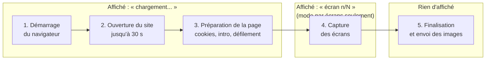

# Viewly : inventaire de la progression

> **Statut** : inventaire des faits, 4 octobre 2026. **Aucun message rédigé.** On relie ce que fait vraiment le serveur pendant une génération à ce que l'utilisateur voit sur la page de chargement. Les mots viendront après le user-test, avec le ton posé (léger sur l'attente).
>
> **Source** : lecture du code (`lib/capture/capture.ts`, `lib/jobs.ts`, `app/api/mockup/route.ts`, `app/page.tsx`).

## Sommaire

- [Ce que l'inventaire révèle](#ce-que-linventaire-révèle)
- [Les étapes réelles](#les-étapes-réelles)
- [Ce que l'utilisateur voit aujourd'hui](#ce-que-lutilisateur-voit-aujourdhui)
- [Problèmes constatés](#problèmes-constatés)
- [Ce qu'on peut annoncer honnêtement](#ce-quon-peut-annoncer-honnêtement)
- [Décisions à prendre](#décisions-à-prendre)

  

## Ce que l'inventaire révèle.

> Résultat : **trois des cinq étapes sont confondues** sous un seul libellé "chargement", et c'est la partie la plus longue et la moins prévisible. En mode vue complète, aucune progression n'est affichée pendant la capture.

  

## Les étapes réelles.

Chaque device est traité **en parallèle** : ces étapes se déroulent en même temps pour desktop, tablette et mobile.

| N° | Étape | Ce que fait le serveur | Durée | Signal envoyé à l'interface |
|---|---|---|---|---|
| 1 | Démarrage | Prépare un navigateur de capture pour le device | Court (plus long si le navigateur doit être relancé) | 0 sur 0 |
| 2 | Ouverture du site | Charge la page et attend la fin du trafic réseau | Jusqu'à 30 s, puis erreur (G3) | 0 sur 0 |
| 3 | Préparation de la page | Détecte une page de blocage, ferme les bannières cookies, attend la fin d'une intro ou d'un préchargeur, fait défiler la page pour charger le contenu | Variable, dépend de la hauteur de la page et des animations | 0 sur 0 |
| 4 | Capture | Mode vue complète : une seule capture. Mode par écrans : une capture par hauteur de fenêtre (au moins 0,3 s chacune) | Court en vue complète, proportionnel au nombre d'écrans sinon | Mode par écrans : "écran n sur N". Vue complète : aucun signal |
| 5 | Finalisation | Convertit les images pour l'envoi | Court à moyen (images lourdes en haute qualité) | Aucun |

Cas particulier : sur les sites au défilement piloté en JavaScript, le nombre total d'écrans est **inconnu** pendant la capture (le total reste à 0), donc l'interface continue d'afficher "chargement".

  

## Ce que l'utilisateur voit aujourd'hui.

- Un titre d'état, un bouton d'annulation, puis une ligne par device : son nom et soit "chargement...", soit "écran n/N".

- L'interface interroge le serveur **toutes les secondes**.

- Les avertissements apparaissent sous les lignes de progression.

- Un clic sur annuler arrête la génération presque immédiatement (le serveur vérifie toutes les 250 ms).

  

## Problèmes constatés.

- **Étapes 1 à 3 confondues** : la longue phase avant la capture s'affiche comme un simple "chargement...", sans indication d'avancement.

- **Aucune progression en vue complète** pendant la capture, ni sur les sites au défilement piloté en JavaScript.

- **Compteur qui part de zéro** : le premier écran peut s'afficher "écran 0 sur N", parce que le compteur avance avant la capture de chaque écran.

- **Un seul avertissement visible** : chaque nouvel avertissement remplace le précédent. Avec trois devices en parallèle, seul le dernier est affiché.

- **Noms bruts dans les avertissements** : ils commencent par le nom technique du device ("desktop :", "mobile :"), alors que les lignes de progression utilisent les noms affichés ("Desktop", "Mobile").

- **Pas de vue d'ensemble** : trois lignes indépendantes, aucun indicateur global.

- **Étape 5 invisible** : la finalisation peut ajouter un délai sans aucun signal.

- **Registre** : les avertissements actuels contiennent des tirets cadratins.

  

## Ce qu'on peut annoncer honnêtement.

Une étape nommée n'est honnête que si elle correspond à un signal réel du serveur. Aujourd'hui, seule l'étape 4 en mode par écrans en a un.

| Étape à annoncer | Signal disponible aujourd'hui | Travail de développement |
|---|---|---|
| Ouverture du site | Non (confondue avec l'étape 3) | Envoyer un signal à la fin du chargement |
| Préparation de la page | Non | Envoyer un signal au début et à la fin |
| Capture des écrans, n sur N | Oui, mode par écrans seulement | Ajouter un signal en vue complète |
| Finalisation | Non | Envoyer un signal avant la conversion |

  

## Décisions à prendre.

- **Tranchée** : un seul indicateur global, sans détail par device (l'utilisateur sait déjà quels devices il a choisis). Conséquence : le nombre total d'écrans n'est connu qu'après l'étape 3, donc l'indicateur est d'abord sans pourcentage. Les avertissements ne citent un device que lorsqu'il est seul concerné.

- **Tranchée** : annoncer des étapes nommées (ouverture du site, préparation de la page, capture des écrans n sur N, finalisation). Demande des signaux supplémentaires côté serveur : tâche de développement.

- **Tranchée** : afficher tous les avertissements distincts, en liste et sans doublon, au lieu de ne garder que le dernier. Tâche de développement.

- **Tranchée** : utiliser les noms affichés (Desktop, Tablette, Mobile) dans les avertissements, et ne citer un device que lorsqu'il est seul concerné.

- **Tranchée** : le compteur d'écrans commence à 1 (« écran 1 sur N » pour le premier, jamais « 0 sur N »).
