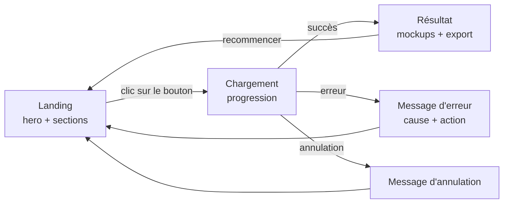
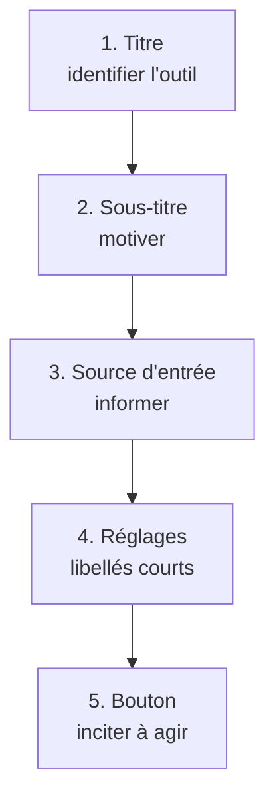
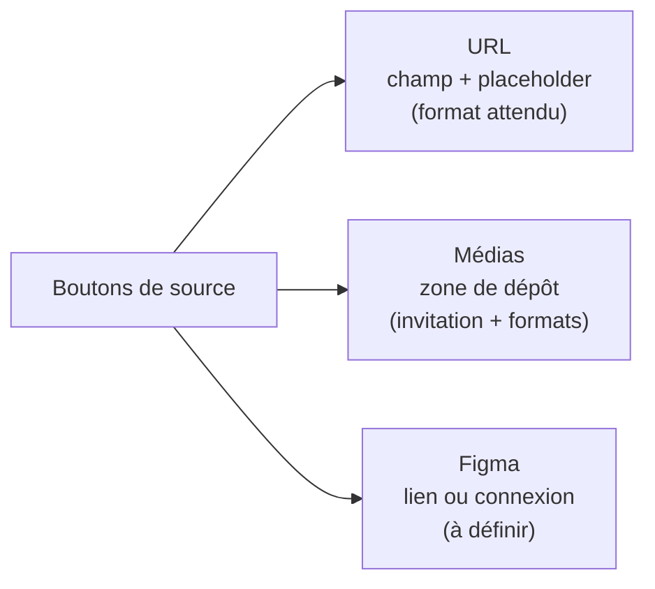

# Viewly : structure du contenu UX writing

> **Statut** : squelette de travail, 3 octobre 2026. **Aucun texte final.** On liste ce qu'il faudra écrire, pas les mots. Le ton et le glossaire sont posés, à tester (user-test) avant de rédiger les textes finaux.
>
> **Copie Notion** : page "UX Writing : Structure du contenu". Si l'une des deux versions change, l'autre ne suit pas toute seule.

<br><br>

## Sommaire

- [Base de travail](#base-de-travail)
- [Vue d'ensemble des pages](#vue-densemble-des-pages)
- [Légende](#légende)
- [Décisions prises](#décisions-prises)
- [Ton et voix](#ton-et-voix)
- [La hero en un coup d'œil](#la-hero-en-un-coup-dœil)
- [Fiches des slots clés](#fiches-des-slots-clés)
- [Landing](#landing)
- [Chargement](#chargement)
- [Résultat](#résultat)
- [Panneau vidéo](#panneau-vidéo)
- [Pages futures](#pages-futures)
- [Glossaire](#glossaire)
- [Questions ouvertes](#questions-ouvertes)
- [Prochaines étapes](#prochaines-étapes)

<br><br>

## Base de travail.

> **Persona et besoin** : un designer ou développeur qui doit produire des visuels de présentation de ses sites (portfolio, réseaux sociaux, présentation client). Il veut un rendu **rapide, avec moins d'effort que la méthode manuelle**, en gardant le contrôle sur le format, la personnalisation et l'export.

- **Limite assumée** : base de recherche secondaire, pas d'entretiens directs. Le vocabulaire réel des utilisateurs est peu connu, donc tout choix de mots reste à tester (user-test).

- **Source** : page Notion "UX Research" (Discover & Define), à ne pas modifier depuis ce travail.

<br><br>

## Vue d'ensemble des pages.

Trois pages aujourd'hui, d'autres à venir. Chaque flèche est un moment où il faut un texte.



> Les retours vers la landing sont une hypothèse de structure, à confirmer au design.

<br><br>

## Légende.

| Symbole | Sens |
|---|---|
| 🔴 | Dépend de la recherche : ton, mots, promesse. À écrire après le user-test du ton. |
| 🟡 | Le fond est fixe, la formulation dépend du ton. |
| ⚪ | Fonctionnel, à geler dès que le design est stable. |
| ⏳ | Fonctionnalité pas encore construite, slot à définir plus tard. |

<br><br>

## Décisions prises.

- **Pages** : landing, chargement, résultat. Des pages s'ajouteront (bibliothèque, import, personnalisation d'export).

- **Réglages** : dans la hero, près de la source, accessibles avant la génération.

- **Ordre de lecture de la hero** : titre, sous-titre, source d'entrée, réglages, bouton.

- **Vocabulaire** : on dit "mockup" (à tester). Risque : chez les designers, le mot peut aussi désigner la maquette de l'interface.

- **Section "à venir"** sur la landing : oui, car les fonctionnalités sont développées en parallèle.

- **Méthode** : fiche complète pour les slots clés seulement, une ligne pour les slots évidents.

<br><br>

## Ton et voix.

> Ton posé le 3 octobre 2026, **à tester (user-test)** auprès de 3 à 5 designers ou développeurs avant de rédiger les textes finaux.

En une phrase : un ton chaleureux, direct et sobre, qui vouvoie sans distance et laisse une touche d'esprit aux moments d'attente.

| Dimension | Choix |
|---|---|
| Registre | Vouvoiement |
| Humour | Léger, avec des limites (tableau suivant) |
| Respect | Respectueux, sans irrévérence |
| Émotion | Factuel : dit ce qui se passe, sans emphase |

Où la légèreté s'applique :

| Léger | Sobre |
|---|---|
| Titre, sous-titre, attente, confirmation du résultat | Erreurs, avertissements, libellés de réglages, aides, accessibilité |

Les textes actuels de l'interface tutoient ("Colle", "Renseigne") : à reprendre au vouvoiement.

<br><br>

## La hero en un coup d'œil.

Schéma de principe. Les mots entre crochets sont des rôles, pas des textes.

```text
┌──────────────────────────────────────────────────┐
│  Navigation (nom du produit, liens d'ancre)      │
│                                                  │
│        TITRE (2 lignes max, gros)                │
│        Sous-titre (2 lignes max)                 │
│                                                  │
│  Source :  [URL]  [Médias]  [Figma bientôt]      │
│  ┌────────────────────────────────────────────┐  │
│  │  Placeholder ou zone de dépôt              │  │
│  └────────────────────────────────────────────┘  │
│                                                  │
│  Réglages :  Mode · Qualité · Devices · Accès    │
│                                                  │
│                   [ BOUTON ]                     │
└──────────────────────────────────────────────────┘
```

Chaque texte a une fonction unique :



<br><br>

## Fiches des slots clés.

> **Titre (hero)**
>
> - **Contexte** : première chose lue. Deux lecteurs : celui qui connaît déjà l'outil (il confirme) et celui qui le découvre (il comprend).
> - **Fonction** : identifier ce qu'est l'outil.
> - **Contraintes** : 2 lignes maximum, gros et impactant (taille au design). Doit parler de "mockup". Citer "URL" est fragile : les futures sources (fichiers, Figma) vont le périmer. À arbitrer.

> **Sous-titre (hero)**
>
> - **Contexte** : il a lu le titre et reste, parce qu'il découvre.
> - **Fonction** : motiver (gain de temps, moins d'effort, contrôle), sans répéter le titre.
> - **Contraintes** : 2 lignes maximum, concis.

> **Source d'entrée (hero)**
>
> - **Contexte** : il comprend vite ce qu'il doit donner. Il donne sa source d'abord, il règle ensuite.
> - **Fonction** : informer sur ce qu'on peut donner.
> - **Contraintes** : textes très courts. Le composant change selon la source (schéma ci-dessous). Les formats acceptés vont probablement dans la zone de dépôt (à confirmer au design).



> **Bouton de génération (hero)**
>
> - **Contexte** : l'utilisateur vient d'arriver, il ne connaît pas encore l'outil.
> - **Besoin** : générer ses mockups sans perdre de temps (à vérifier).
> - **Fonction** : inciter à agir. Le contexte est porté par le titre et le sous-titre.
> - **Contraintes** : environ 1 mot, un seul état. Doit signaler une action immédiate, pas une navigation.

<br><br>

## Landing.

| Slot | Rôle et contrainte | Dép. |
|---|---|---|
| Navigation et pied de page | Nom du produit, liens d'ancre, mentions. Très court. | 🟡 |
| Titre (hero) | Voir fiche. | 🔴 |
| Sous-titre (hero) | Voir fiche. | 🔴 |
| Boutons de source | Choisir le type de source (URL, médias, Figma à venir). 1 libellé très court par source. | 🟡 |
| Source URL : placeholder | Montrer le format attendu. Très court. | ⚪ |
| Source médias : zone de dépôt | Invitation à déposer + formats acceptés. 1 ligne + formats. | 🟡 |
| Source Figma | Lien ou connexion. Fonctionnalité à construire. | ⏳ |
| Réglages : mode de capture | Légende + 2 options. Libellés courts. | ⚪ |
| Réglages : qualité | Légende + 2 options. Libellés courts. | ⚪ |
| Réglages : devices | Légende + 3 noms + presets + "Personnalisé" + largeur/hauteur. | ⚪ |
| Réglages : aides | Ce que changent mode et qualité. Probablement au survol ou au clic. | 🟡 |
| Site protégé | Déclencheur + identifiant + mot de passe + note de sécurité. | 🟡 |
| Bouton de génération | Voir fiche. | 🔴 |
| Erreurs de saisie | URL invalide, source vide, fichier non accepté, résolution hors bornes (200 à 3840). Cause + action. | 🟡 |
| Section problème | La méthode manuelle pénible (capturer, adapter, Photoshop, exporter). | 🔴 |
| Section comment ça marche | Titre de section + 3 étapes (source, réglages, résultat). | 🟡 |
| Section usages | 1 bloc par usage : portfolio, réseaux sociaux, présentation client. | 🔴 |
| Section contrôle | Formats et export (PNG, WebP, PDF, ZIP). | 🟡 |
| Section à venir | Fonctionnalités annoncées. Pas de date. Statut : à venir, disponible ou retiré. À mettre à jour avec le slot source quand une fonctionnalité sort. | 🔴 |
| Section objections (FAQ) | Confidentialité, sites protégés, limites. | 🟡 |
| Appel final | CTA de fin de page. | 🔴 |
| Méta | Titre de l'onglet, description, favicon. | 🔴 |

<br><br>

## Chargement.

| Slot | Rôle et contrainte | Dép. |
|---|---|---|
| Titre d'état | Dire que la génération est en cours. | 🟡 |
| Étapes de progression | Par device : chargement, écran n sur total. Doivent correspondre à ce que fait vraiment le serveur. | ⚪ |
| Message d'attente longue | Au-delà d'environ 10 s, rassurer et informer. | 🟡 |
| Avertissements | 3 cas existants : scroll piloté en JavaScript (2 variantes), page longue. Non bloquants. | 🟡 |
| Annulation | Bouton + confirmation d'annulation + état annulé (avec ou sans relance). | 🟡 |
| Erreurs de génération | Familles : site bloquant (anti-bot), échec générique, génération expirée, connexion perdue, erreurs techniques à reformuler (ex. ffmpeg). Cause + action possible. | 🟡 |
| Erreur inconnue | Message de repli. | 🟡 |

<br><br>

## Résultat.

| Slot | Rôle et contrainte | Dép. |
|---|---|---|
| Titre / confirmation | Dire ce qui a été produit. Absent aujourd'hui. | 🔴 |
| Groupes par device | Noms Desktop, Tablette, Mobile. | ⚪ |
| Libellé d'écran | "Écran N". | ⚪ |
| Alt des images | Texte accessible, par mockup et pour la lightbox. | ⚪ |
| Export : format | Libellé + noms de formats. | ⚪ |
| Export : actions | Télécharger un mockup, tout télécharger (zip), états de préparation. | 🟡 |
| Erreur d'export | Cause + action. | 🟡 |
| Lightbox | Aide à la fermeture. | 🟡 |
| Recommencer | Lancer une nouvelle génération. Absent aujourd'hui. | 🟡 |
| Mention de conservation | Dire que les résultats sont gardés dans cette fenêtre et perdus à sa fermeture. Essentiel : sans elle, du travail peut être perdu. Absent aujourd'hui. | 🟡 |
| Stockage indisponible | Erreur quand le navigateur ne peut pas garder les résultats (stockage plein, navigation privée). Cause + action. | 🟡 |
| État vide / aucun résultat | Cas où aucune image n'est produite. Absent aujourd'hui. | 🟡 |

<br><br>

## Panneau vidéo.

Disponible en mode "par écrans".

| Slot | Rôle et contrainte | Dép. |
|---|---|---|
| Ouvrir / annuler | Déclencheur du panneau. | 🟡 |
| Durée | Label + presets + placeholder personnalisé + bornes (1 à 30 s). | ⚪ |
| Qualité | Label + options (dont "native"). | ⚪ |
| Mouvement | Scroll vers l'écran suivant + raison de l'état désactivé. | 🟡 |
| Survol | Déclencheur de recherche, état de chargement, option "aucun", cas "aucun élément trouvé" (absent aujourd'hui). | 🟡 |
| Lancer la capture | Bouton + état de capture en cours. | 🟡 |
| Résultat vidéo | Télécharger la vidéo, erreur vidéo. | 🟡 |

<br><br>

## Pages futures.

Une page ajoutée = une section de plus dans ce document : import par fichier, import Figma, personnalisation d'export, et la bibliothèque ci-dessous. ⏳

### Bibliothèque

Catalogue de **modèles prêts à l'emploi** (scènes, devices, layouts), gratuits et libres d'usage commercial. Ce n'est pas un espace où l'utilisateur retrouve ses générations : pas de compte, ses résultats restent dans son navigateur.

| Slot | Rôle et contrainte | Dép. |
|---|---|---|
| Titre et introduction | Dire ce qu'on trouve ici (modèles prêts à l'emploi). | 🔴 |
| Catégories | Scènes, devices, layouts. Libellés courts. | 🟡 |
| Fiche d'un modèle | Nom, aperçu, courte description éventuelle. | 🟡 |
| Licence d'usage | Dire que c'est gratuit et libre d'usage commercial. Slot sensible : à valider juridiquement avant de rédiger. | 🔴 |
| Bouton pour utiliser un modèle | Appliquer le modèle à une génération. Action immédiate. | 🟡 |
| Recherche ou filtre sans résultat | État vide. | 🟡 |

> **Vigilance sur le vocabulaire** : dans le glossaire, "mockup" désigne le rendu produit. Dans la bibliothèque, les éléments sont des modèles (scène, cadre d'appareil, layout). Si les deux s'appellent "mockup", risque de confusion : un terme distinct est à choisir (modèle, scène, gabarit...) et à tester au second tour de user-test.

<br><br>

## Glossaire.

Tous les termes sont **à tester (user-test)** : ils viennent de nous, pas d'utilisateurs réels.

| Terme retenu | Désigne | À éviter | Statut |
|---|---|---|---|
| mockup | Le rendu produit | visuel de présentation, maquette, capture | à tester |
| source | Ce que l'utilisateur donne (URL, médias, Figma) | site, lien | à tester |
| devices | Desktop, tablette et mobile pris ensemble | appareils, formats | à tester |
| réglages | Mode, qualité, devices, accès protégé | paramètres, options | à tester |
| générer | Lancer la création des mockups (famille de verbes du bouton) | créer, lancer | à tester |

<br><br>

## Questions ouvertes.

- User-test du ton et du glossaire auprès de 3 à 5 designers ou développeurs (le vouvoiement passe-t-il bien auprès d'un public technique ? les mots clés sont-ils ceux qu'ils emploient ?).

- "URL" dans le titre ou le sous-titre ?

- Où écrire les aides de mode et qualité (survol, clic, landing) ?

- Où écrire les formats acceptés (zone de dépôt, aide) ?

- Section "à venir" : qui met à jour le statut quand une fonctionnalité sort ?

- Terme pour les éléments de la bibliothèque (modèle, scène, gabarit), distinct de "mockup" : à tester au second tour de user-test.

- Proportion de lecteurs qui connaissent déjà l'outil et de ceux qui le découvrent (hypothèse non vérifiée).

<br><br>

## Prochaines étapes.

1. Relire ce document et corriger ce qui est faux.

2. Geler les slots ⚪ une fois le design stable.

3. User-test du ton et du glossaire (3 à 5 personnes de la cible).

4. Rédiger les slots 🔴 et 🟡, puis fixer les longueurs maximales après les maquettes.

5. Tester les textes (test des 5 secondes sur la hero, test de rappel).
