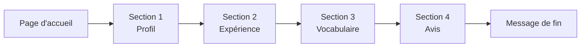

# Viewly : formulaire de user-test

> **Statut** : questions rédigées et formulaire envoyé le 3 octobre 2026, en attente des réponses. Un seul formulaire sert deux recherches : la recherche UX (pratiques réelles des designers et développeurs) et le test du ton et du glossaire UX writing.
>
> **Outil** : Google Forms (gratuit). Lien du formulaire : à ajouter ici.

## Sommaire

- [Comment utiliser ce document](#comment-utiliser-ce-document)
- [Le formulaire à recopier](#le-formulaire-à-recopier)
- [Notes pour moi (à ne pas copier)](#notes-pour-moi-à-ne-pas-copier)

  

## Comment utiliser ce document.

> **Tout ce qui se trouve dans la partie "Le formulaire à recopier" va dans Google Forms.** Chaque question a son type, son texte exact et son caractère obligatoire. Tout le reste du document est pour toi et ne va pas dans le formulaire.

**Total** : 15 champs (13 questions et 2 "Pourquoi ?" facultatifs), environ 8 minutes.

  

## Le formulaire à recopier.

Les textes ci-dessous sont **volontairement sans "tu" ni "vous"** pour ne pas influencer le test du registre de la section 4. Ne les reformule pas en adressant la personne.

### Page d'accueil

| Champ Google Forms | Texte à copier |
|---|---|
| Titre du formulaire | Présenter un site web : quelques questions |
| Description | Un outil est en préparation pour aider à présenter un site web (portfolio, réseaux sociaux, client). Ce formulaire sert à comprendre comment les designers et développeurs présentent leurs sites aujourd'hui, et à tester quelques mots. Une quinzaine de questions, environ 8 minutes. Il n'y a pas de bonne ou de mauvaise réponse : c'est la façon dont les choses sont dites qui compte. Les réponses sont anonymes. |

### Section 1 : Profil

Titre de la section : **Profil**

| N° | Type | Texte à copier | Options | Obligatoire |
|---|---|---|---|---|
| 1 | Choix multiples | Profil | Designer / Développeur / Les deux / Autre (ajouter l'option "Autre") | Oui |

### Section 2 : Expérience

Titre de la section : **Expérience**. Description de la section : *Réponses libres, quelques lignes suffisent.*

| N° | Type | Texte à copier | Obligatoire |
|---|---|---|---|
| 2 | Réponse longue | Dernière fin de projet : comment cela s'est-il passé, de la maquette jusqu'à la présentation au client ou au jury ? | Oui |
| 3 | Réponse longue | Comment un site web est-il mis en avant auprès d'un jury, d'un client ou dans un portfolio ? | Non |
| 4 | Réponse longue | Un jury ou un client a-t-il déjà réagi aux visuels de présentation d'un projet ? Quel souvenir précis en reste-t-il ? | Non |
| 5 | Réponse longue | La dernière fois qu'un site web a été présenté : comment cela s'est-il passé ? | Non |

### Section 3 : Vocabulaire

Titre de la section : **Vocabulaire**. Description de la section (à copier) :

> Un outil prend un site web et en sort automatiquement des images de ce site sur ordinateur, tablette et mobile, prêtes à servir dans une présentation. Une expression par réponse suffit.

| N° | Type | Texte à copier | Obligatoire |
|---|---|---|---|
| 6 | Réponse courte | Comment appeler ces images ? | Non |
| 7 | Réponse courte | Comment appeler ce qu'on donne à l'outil pour démarrer ? (aujourd'hui un site web, plus tard peut-être des fichiers ou une maquette Figma) | Non |
| 8 | Réponse courte | Ordinateur, tablette, mobile : comment appeler ces trois choix pris ensemble ? | Non |
| 9 | Réponse courte | Le bouton qui déclenche la création des images : quel mot ou quelle expression y mettre ? | Non |

### Section 4 : Avis

Titre de la section : **Avis**

**Question 10 : type "Grille à choix multiples"**

| Champ | À copier |
|---|---|
| Texte de la question | Pour chaque mot, dans la phrase proposée : à quel point est-il clair ? |
| Lignes (une par mot) | mockup : "L'outil génère des mockups du site." / source : "Source : lien, fichiers ou maquette." / devices : "Sélection des devices à générer." / réglages : "Réglages avant de lancer." / générer : "Générer" (libellé de bouton) |
| Colonnes | Clair / Plutôt clair / Peu clair / Pas clair |
| Obligatoire | Oui |

| N° | Type | Texte à copier | Obligatoire |
|---|---|---|---|
| 11 | Réponse longue | Un de ces mots paraît-il bizarre ou ambigu ? Lequel, et pourquoi ? | Non |

**Question 12 : type "Choix multiples"**

| Champ | À copier |
|---|---|
| Texte de la question | Message affiché pendant l'attente. Quelle version est préférée ? |
| Description de la question | Version A : "On capture chaque écran de votre site... Pas de panique, ça ne prend que quelques secondes." Version B : "On capture chaque écran de ton site... Pas de panique, ça ne prend que quelques secondes." |
| Options | Version A / Version B / Aucune préférence |
| Obligatoire | Oui |

| N° | Type | Texte à copier | Obligatoire |
|---|---|---|---|
| 13 | Réponse courte | Pourquoi ? | Non |

**Question 14 : type "Choix multiples"**

| Champ | À copier |
|---|---|
| Texte de la question | Message d'erreur. Quelle version est préférée ? |
| Description de la question | Version A : "Ce site bloque la capture automatique. Essayez une autre source ou réessayez plus tard." Version B : "Ce site bloque la capture automatique. Essaie une autre source ou réessaie plus tard." |
| Options | Version A / Version B / Aucune préférence |
| Obligatoire | Oui |

| N° | Type | Texte à copier | Obligatoire |
|---|---|---|---|
| 15 | Réponse courte | Pourquoi ? | Non |

### Message de fin

Paramètres de Google Forms, onglet "Présentation", champ "Message de confirmation" :

> Merci pour ces réponses.

### À vérifier dans les paramètres

- "Collecter les adresses e-mail" : **désactivé** (réponses anonymes).
- "Limiter à une réponse" : **désactivé** (sinon les gens doivent se connecter).

  

## Notes pour moi (à ne pas copier).

> Tout ce qui suit est la logique derrière le formulaire. Rien de cette partie ne va dans Google Forms.

### Pourquoi cet ordre

On **ne montre jamais nos mots avant d'avoir recueilli les leurs**, sinon les réponses sont influencées. C'est aussi pour cela que tout le formulaire est écrit sans "tu" ni "vous", sauf les versions A et B de la section 4.

- Section 2 : le passé réel, pour la recherche UX.

- Section 3 : leurs mots spontanés, sans aucun de nos termes.

- Section 4 : nos choix (mots et registre), en dernier.

Les messages A et B sont des **supports de test**, pas des textes finaux. Ils ne diffèrent que par le pronom, ce qui isole ce qu'on veut savoir.

### Si le formulaire est trop long

Couper en premier les questions 4 et 8.

### Lire les résultats

Avec 3 à 5 réponses, on ne fait pas de statistiques : on cherche des signaux qui se répètent.

| Signal | Décision |
|---|---|
| Au moins 2 personnes emploient spontanément le même autre mot (questions 6 à 9) | Remplacer le terme ou l'ajouter au glossaire |
| Un terme jugé "peu clair" ou "pas clair" par au moins 2 personnes (question 10) | Reformuler, ajouter une aide ou changer de mot |
| La majorité préfère le tutoiement (questions 12 et 14) | Rouvrir la décision de registre |
| Réponses partagées | Garder le choix actuel et noter l'hésitation |

Les réponses des questions 2 à 5 alimentent la recherche UX (nouveaux insights sur les pratiques de présentation). Elles sont à reporter dans la page UX Research par la conversation qui en est responsable.

### Diffusion

- Envoyer le lien à 5 à 8 personnes pour obtenir 3 à 5 réponses.

- Cibles : designers et développeurs, même débutants (promo, connaissances, communautés en ligne).

- Le formulaire est anonyme : si une réponse mérite une relance, c'est à toi de savoir à qui tu l'avais envoyé.
